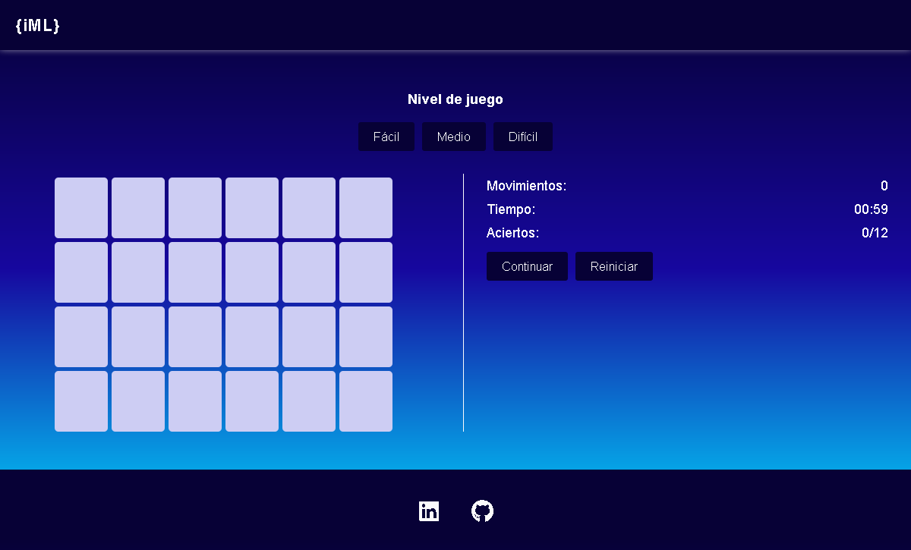

# Juego de memoria

  <h3>
    <a href="https://morlabdev.github.io/memoryGame_JS/" target="_blank">Probar juego</a>
     | 
    <a href="https://www.linkedin.com/in/israelmorenolabrador/"  target="_blank">Feedback</a>
  </h3>

# Vista previa
<h3>Pantalla inicial</h3>

<h3>Responsive</h3>

  
  

